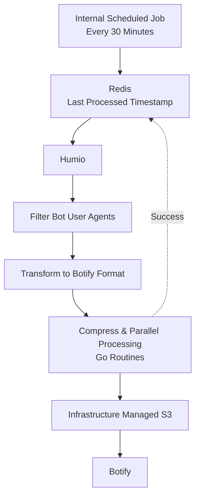

# Building a Reliable Crawl Log Ingestion Pipeline

> **Tech:** Go · Redis · Amazon S3 · Humio · AWS IAM  
> **Focus:** Distributed Systems · Data Engineering · Incremental Processing · Operational Reliability

---

## Overview

Search engine crawlers are one of the primary ways customers discover web content, but understanding how they interact with a website requires analyzing production access logs rather than simulated crawls.

To support our SEO team, I built a scheduled ingestion pipeline that continuously extracted crawler logs from Humio, transformed them into Botify's required format, and securely delivered them through Amazon S3 for downstream analysis.

The challenge wasn't simply moving data between systems. It was building a reliable pipeline around several real-world operational constraints:

- Search engine crawl traffic varied significantly throughout the day.
- Humio returned query results asynchronously and in limited batches.
- Botify imposed a maximum ingestion limit of **5 GB per hour**.
- Infrastructure ownership restricted how S3 buckets could be provisioned.
- Security policies no longer allowed long-lived AWS credentials for third-party integrations.

The system evolved considerably after deployment as production traffic exposed assumptions that differed from the initial design.

---

# The Problem

Most SEO tools estimate how search engines crawl a website. We wanted visibility into **actual production crawl behavior**.

Botify required crawler logs to be uploaded in a specific format through Amazon S3. Those logs lived inside Humio alongside all production web traffic.

The ingestion pipeline needed to:

- continuously retrieve newly available logs
- isolate crawler traffic from general application traffic
- transform logs into Botify's ingestion format
- securely deliver files through S3
- avoid duplicate processing
- recover gracefully from failures

---

# Initial Design

Based on historical queries against known crawler user agents, it was initially estimated the service would process roughly **5,000 crawler log entries per hour**.

The application was built using an internal scheduled-job template that standardized deployment and scheduling. My work focused on the ingestion pipeline itself rather than the scheduling infrastructure.

The original workflow was straightforward:

1. Query Humio for newly available logs.
2. Filter crawler traffic.
3. Transform the results.
4. Compress the output.
5. Upload the files to Amazon S3.

---

# Production Learnings

Once deployed, production traffic quickly invalidated the initial assumptions.

Crawler activity wasn't predictable.

Depending on when different search engines scheduled their crawls, a processing window could contain anywhere from **5,000 to over 80,000 crawler log entries**.

At the same time:

- the SEO team continued expanding the list of supported crawler user agents
- larger crawler datasets increased processing time
- compression and uploads began approaching runtime limits
- Botify limited uploads to **5 GB of logs per hour**

The engineering problem shifted from transforming data to building a system that could reliably operate under highly variable workloads.

---

# Key Engineering Decisions

## Increasing the Processing Frequency

One of the first architectural changes I made was reducing the processing interval from **one hour to every thirty minutes**.

Although hourly execution met the functional requirements, smaller processing windows significantly improved operational resilience.

The change provided several benefits:

- smaller batches reduced processing time
- failures required recovering at most thirty minutes of data
- reduced the likelihood of exceeding Botify's hourly ingestion limits
- handled crawler traffic spikes more gracefully

This became particularly important as production crawl volume increased.

---

## Incremental Processing with Checkpointing

The service needed to process only newly available logs without duplicating previously uploaded data.

To accomplish this, I implemented checkpointing using Redis.

Each successful execution stored the timestamp of the most recently processed log.

Subsequent executions queried Humio using:

```
lastProcessedTimestamp → currentTime
```

The checkpoint was only advanced after the pipeline successfully completed.

This allowed failed executions to resume from the last successful state instead of restarting from scratch.

---

## Filtering Early

Humio contained all production web traffic, but only a subset represented search engine crawlers.

Crawler requests were identified using regular expressions against known bot user-agent strings.

Filtering occurred as early as possible in the pipeline, dramatically reducing the amount of data requiring downstream transformation, compression, and upload.

---

## Polling and Pagination

Humio queries executed asynchronously and returned results in limited batches.

The ingestion service continuously polled for query completion and paginated through the returned results until the entire processing window had been retrieved.

This ensured complete ingestion without missing crawler activity during larger processing windows.

---

## Parallel Processing

As crawler traffic increased, compression and uploads began approaching runtime limits.

To improve throughput, I introduced concurrency using Go routines.

Processing multiple batches simultaneously significantly reduced execution time and allowed the service to continue handling larger crawler datasets without exceeding runtime constraints.

---

# Security and Infrastructure Challenges

One of the more interesting challenges wasn't technical, it was organizational.

Infrastructure-managed resources followed strict ownership boundaries.

My organization no longer allowed creating one-off Amazon S3 buckets for individual integrations, S3 buckets were provisioned and managed through dedicated infrastructure services.

The original integration approach also assumed Botify would access S3 using long-lived AWS credentials.

That was no longer permitted under our updated security model.

To align with both infrastructure ownership and security requirements, I designed the integration around a dedicated storage service responsible for provisioning and managing the S3 bucket.

The ingestion pipeline received permission to publish artifacts to that managed bucket, while Botify accessed those artifacts through a dedicated IAM role instead of persistent AWS credentials.

This approach:

- respected existing infrastructure ownership
- eliminated long-lived credentials
- satisfied security requirements
- avoided creating one-off infrastructure exceptions

---

# Operational Reliability

Because the pipeline depended on multiple external systems, operational visibility was essential.

The service included:

- retry logic for transient failures
- monitoring for scheduled executions
- alerting for pipeline failures
- persistent checkpointing to simplify recovery

---

# High-Level Architecture



---

# Results

- Automated crawl log ingestion for downstream SEO analysis
- Processed highly variable crawler workloads ranging from approximately **5,000 to over 80,000** crawler log entries
- Reduced recovery time by processing smaller incremental windows
- Eliminated duplicate processing through checkpointing
- Improved throughput through concurrent processing
- Integrated securely with third-party systems without long-lived AWS credentials
- Built a reliable production pipeline capable of operating unattended

---

# Lessons Learned

This project reinforced that production systems rarely behave exactly as expected.

The original implementation was designed around relatively small, predictable workloads.

Real production traffic, evolving business requirements, and changing infrastructure policies required the architecture to evolve.

Rather than treating those discoveries as failures, I iteratively improved the system by:

- reducing processing windows
- introducing checkpointing
- parallelizing expensive operations
- redesigning the security model
- improving operational visibility

The end result was a significantly more resilient ingestion pipeline capable of adapting to changing workloads while remaining reliable, secure, and maintainable.
